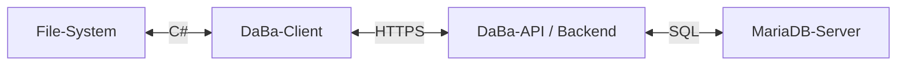

  

<h1 align="center">DaBa File Manager</h1>
<h3 align="center">file manager with multi-user support and end-to-end file-encryption</h3>

## Logo Idea

- create a logo with vibrant colors, that uses a [database icon](https://icons.getbootstrap.com/icons/database-fill/) with the bracket of a lock (the top part of a lock)
